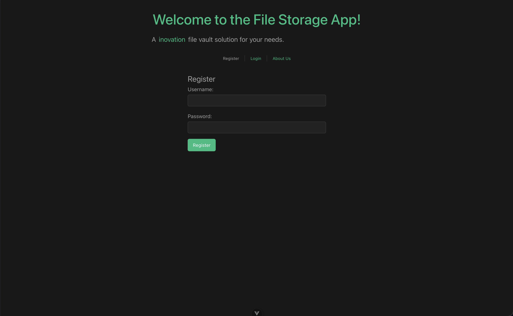
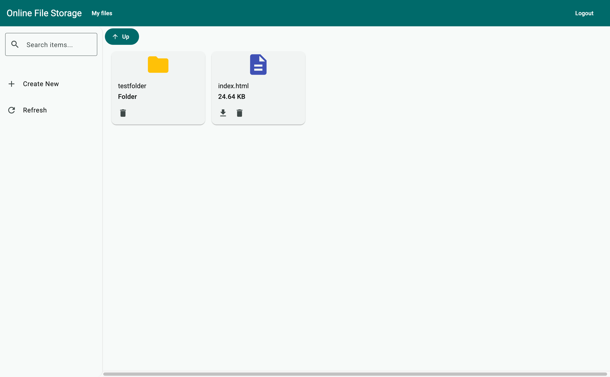
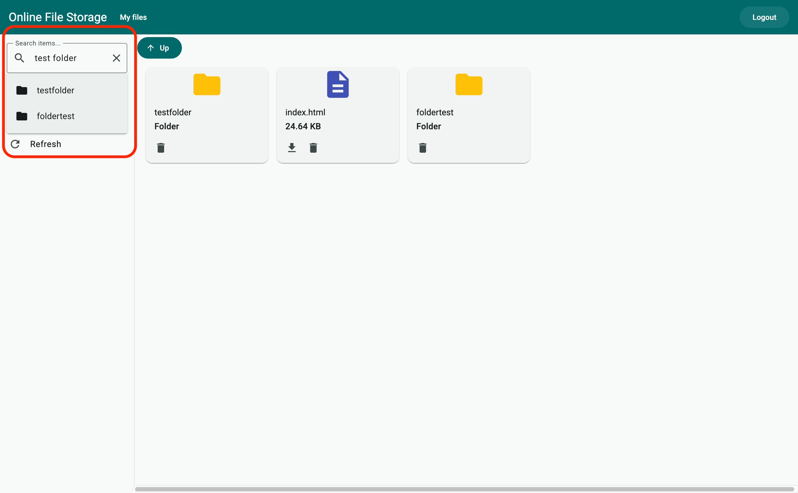
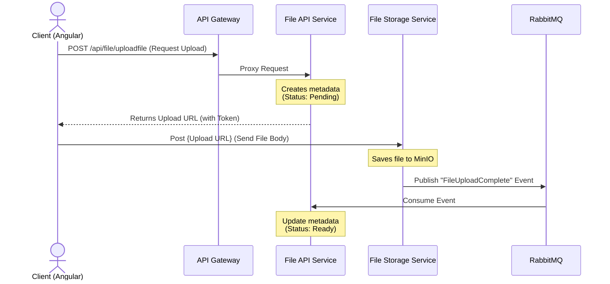

# OnlineFileStorage


## Screenshots


<details>
  <summary><h2>Other screenshots</h2></summary>
  
  <h3>Search</h3>
  

  <h3>Item creation page</h3>
  
  
  </details>

## Architecture Schema


### Backend & Architecture
* **Framework:** ASP.NET Core (.NET 9)
* **Architecture** Clean Architecture, Microservices
* **ORM:** Entity Framework
* **Logging:** ELK, Serilog
* **Communication:** gRPC (Inter-service), RabbitMQ (Event Bus)
* **Database:** PostgreSQL, Redis (Caching)
* **Storage:** MinIO (S3 compatible object storage)
* **Auth:** JWT token 

## Microservices
### File Api Microservice
* ASP.NET Core web API
* Clean Architecture
* REST API Principles
* Search files using trigrams
* Full implementation of result pattern in business logic
* High perform GRPC communication with File storage service
* Redis distributed caching for optimization
* Asynchronous communication via RabbitMQ with File storage service
* Using Entity Framework ORM 
* Secured API endpoints using JWT authentication passed via API Gateway
* PostgreSQL database to store files metadata
* Implemented Unit Tests using xUnit and Moq to ensure business logic reliability
  
### File Storage Microservice
* ASP.NET Core web API
* Clean Architecture
* REST API Principles
* Background service for removing expired files
* High perform GRPC communication with File api service
* Secured API endpoints using JWT authentication passed via API Gateway
* Fully implementation of result pattern in business logic
* Asynchronous communication via RabbitMQ with File api service
* Using MinIO storage for files

### Identity Microservice
* ASP.NET Core web API
* Clean Architecture
* REST API Principles
* Fully implementation of result pattern in business logic
* Using Entity Framework ORM
* Secured API endpoints using JWT authentication passed via API Gateway
* JWT token logic
* PostgreSQL database to store users data
* Hashing of user password
* Fluent Validation of passwords
* Implemented Unit Tests using xUnit and Moq to ensure business logic reliability

### API Gateway Ocelot
* Implement API Gateways with Ocelot
* JWT token validation

### Supporting
* PgAdmin for postgreSQL
* Swagger for every microservice
  
### Observability & Logging
* **Logging:** Serilog
* **Monitoring Stack:** Elasticsearch, Kibana (ELK)

### Docker/Docker-compose
* Containerization of microservices
* Containerization of databases
* Environment variables and passwords in .env file

### Frontend
* Angular
* Meterial design

## Workflow Diagrams
### Upload File
To optimize performance, the system uses a Direct Upload Pattern. The heavy file traffic bypasses the metadata service to reduce load.


## Getting Started

### Prerequisites
* Docker & Docker Compose
* .NET 9 SDK
* Node.js (Latest LTS version recommended)
* Angular CLI (globally installed via `npm install -g @angular/cli`)

### Run with Docker

#### Environment file
Before start create .env file in /OnlineFileStorage/src
<b>Example of .env file</b>:
<details>
  <summary><b>Click to expand the example .env file</b></summary>
  
```ini
JWT_SECRET=45158dbfeaf5e7d36f14353b01acc7c1fc225b4b2bdc2acb727a7e18add713e8
JWT_AUDIENCE=ApiClients
JWT_ISSUER=OnlineFileStorage

RABBITMQ_USER=guest
RABBITMQ_PASS=guest

PGADMIN_EMAIL=admin@admin.com
PGADMIN_PASSWORD=admin

MINIO_ACCESS_KEY=minio
MINIO_SECRET_KEY=minio123

POSTGRES_USER=postgres
POSTGRES_PASSWORD=admin

ConnectionStrings__IdentityConnection=Host=host.docker.internal;Port=5432;Database=identityServiceDb;Username=postgres;Password=admin
ConnectionStrings__FileApiConnection=Host=host.docker.internal;Port=5432;Database=fileApiServiceDb;Username=postgres;Password=admin
```
</details>

#### To start the entire backend infrastructure (Databases, MinIO, RabbitMQ, ELK) and services:
```bash
git clone
cd OnlineFileStorage/src
docker-compose up -d
```

#### To start the frontend on vue:
```bash
cd OnlineFileStorage/frontend/AngularFrontend
npm install
npm start
```

## Testing
The project ensures reliability through automated testing.
* Unit Tests: Implemented using xUnit and Moq to cover core business logic.
To run tests:
```bash
cd OnlineFileStorage/src/Tests/(service that you need)
dotnet test
```
